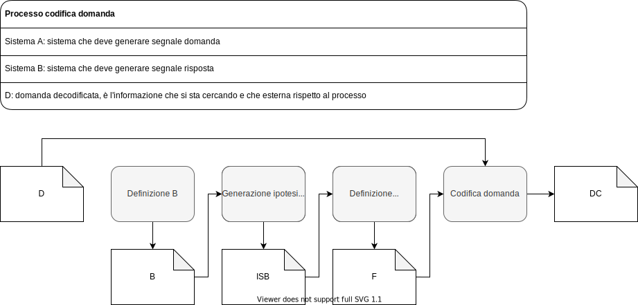
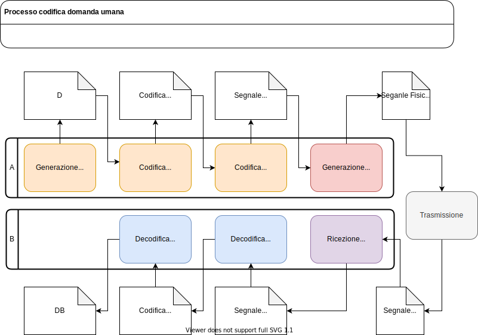
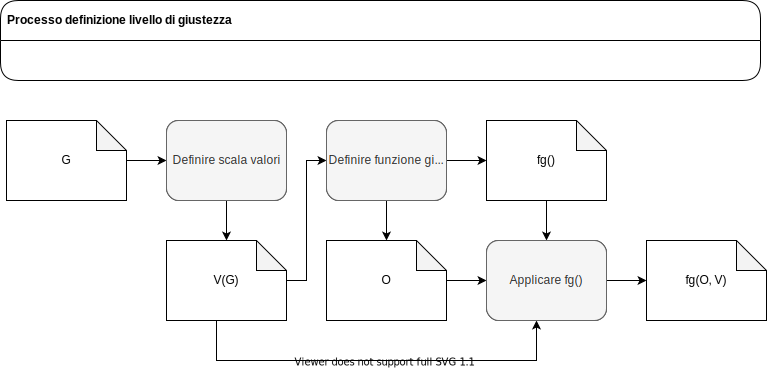
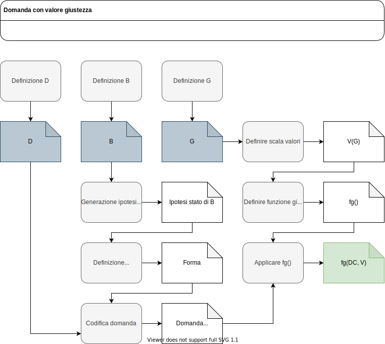
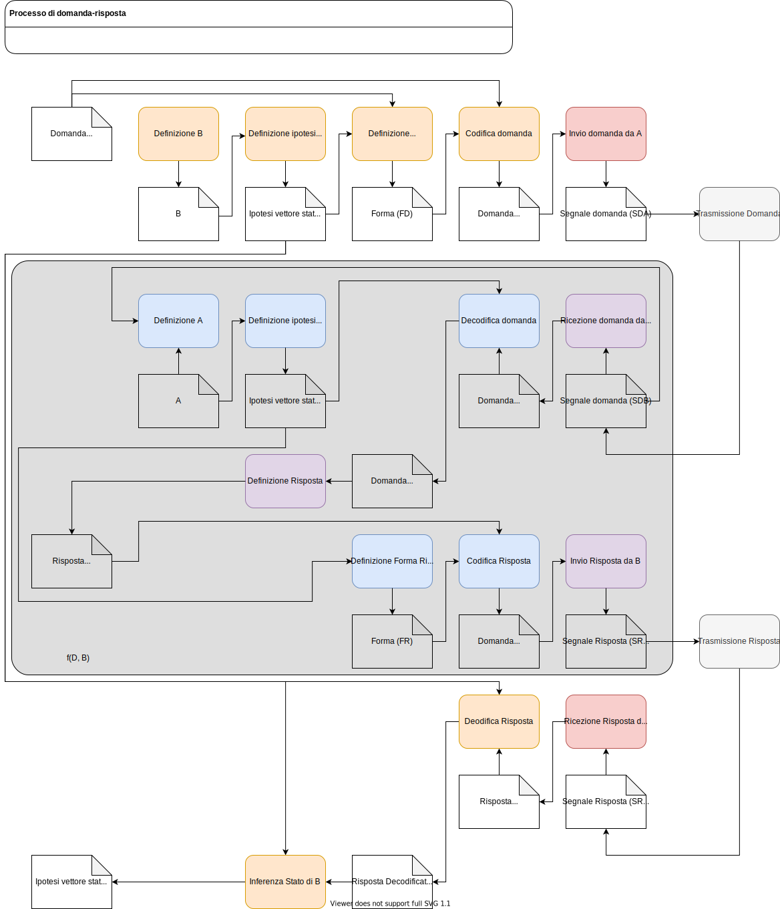
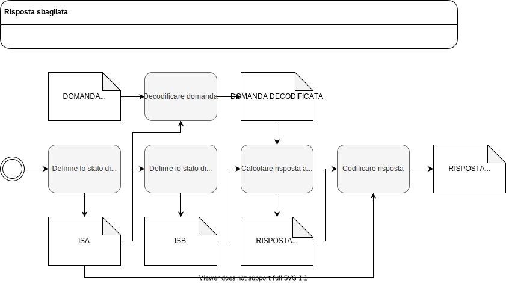

# Introduzione

Quello che state per leggere non è neanche lontanamente sensato, non ha alcuna utilità pratica e molto probabilmente vi farà solo perdere tempo.
Nel migliore dei casi si intende.

La domanda da cui nasce tutto è la seguente.\
*"Come si generano risposte sbagliate?"*.\
Che in realtà è una bella domanda
.

Come da programma potremmo inziare una noiosa esegesi (spoliler: è proprio quello che faremo) chiedendoci innanzitutto cosa sia un risposta e cosa significhi sbagliato.\
Tuttavia potremmo, alternativamente, dare respiro alla nostra anima ribelle e chiederci:\
*"Come si generano domande giuste?"*

Questo perchè **domande** e **risposte** compaiono spesso insieme, ditocomiche, proprio come giusto e sbagliato.\
In effetti un'altra ottima domanda sarebbe chiedersi:  
*"Perchè la natura di queste cose tende ad essere così terribilmente boleana?"*.\
Perchè siamo ossesionati dalle strutture binarie?

Ancora più terribile è la natura autoreferenziale di questi quesiti, storico tallone di achille della logica.
Sapersi destreggiare tra diversi livelli di astrazione e saper distinguere tra modelli, meta-modelli e meta-meta-modelli è vitale per non rimanere presto ingarbugliati.

Ma andiamo con ordine.

# Cosa è una domanda?

($l_1$)*"Cosè una domanda?"*\
Bhe, ottima domanda, una ancora migliore potrebbe essere:\
($l_2$)*"Come si risponde a una domanda del genere?"*\
O ancora;\
($l_3$)*"Perchè chiedersi come rispondere a una domanda del genere è meglio di chiedersi cosa sia una domanda?"*

Iniziamo dall'inizio: *"Come si capiscono le cose?"*\
Bhe questo è **facile**, abbiamo tutti passato due decenni delle nostre vite sui libri.  
Sappiamo tutti che si è compreso qualcosa solo quando la si può vedere, al contempo, uguale e diverso da ogni altra cosa.  
Per cui.

## Generalizzare: tutto è uguale a tutto

> "Da quassù la Terra è bellissima, senza frontiere né confini"
>
> Jurij Alekseevič Gagarin

Tutto è una domanda ovviamente: una stringa di testo, un fotone che interagisce con una particella, un sopracciglio alzato in richiesta di spiegazioni.

A un livello generale (più su questo dopo):  
($l_1$)"Una domanda è un segnale di di input ad una funzione di risposta".  
($l_2$)"Quello che stiamo facendo è generalizzare, vale a dire trovare gli elementi in comune fra il nostro oggetto di analisi e il resto del mondo o, in temini più tecnici, aggiugendo gradi di libertà."  
($l_3$)"Questo è particolarmente utile perchè ci permette di usare tutto quello che era vero per la generalizzazione all'interno del nostro oggetto, in altre parole, per gli amici appassionati di OOP, abbiamo appena ereditato una matriciana di metodi."

In particolare, ora sappiamo che per ogni domanda (input) dovrà esistere una risposta (output) e una funzione, che in un impeto di fantasia chiameremo $f(D)$ che sarà in grado di associare l'oggetto $D$ a l'oggetto $R$.\
Il nostro sistema binario è appena diventato ternario.\
Per definire il concetto di domanda è necessario definire il concetto di risposta.\

Tutto bene finora.

Bhe, ma un momento, colpire un passante con una mazza non è propriamente lo stesso che chiedergli che ore sono?... o lo è?\
Bhe, ottima domanda

In effetti *qual'è la differenza?*\
Ma soprattutto *ci serve saperlo?*

## Particolareggiare: niente è perfettamente uguale a niente

> "Perchè diavolo devo dirle quanto sono alto?"
>
> Un quadrato ad un sarto per quadrilateri

Ora che sappiamo che le domande e riposte sono solo input e output (I/O), una domanda ci sorge abbastanza ovvia, *perchè diavolo gli esseri umani hanno deciso di dividere il mondo in due* tracciando una linea tra ciò che ha una dignità di essere domanda e cosa no?.

E' ora di scendere della montagana nell'oscura selva popolata da quelli che amano le etichette.\
Scendiamo dicevo, ma con metodo.

La cosa figa di particolaggiare è che aggiungere attributi ad un oggetto ha un effetto particolarmente benefico sulle capacità di calcolo delle probabilità condizionali (ringraziamo l'amico Bayes) e quindi sulla capacità di previsione del comportamento dell'oggetto stesso.\
E salta fuori che sapere distinguere una tigre da un cepuglio di felci, nonostante siano entrambi fatti di atomi, dia a un bel boost alle probabilità di sopravvivenza.

Quindi, se generalizzare significa togliere gradi libertà, questo dovrebbe essere il momento di aggiungere attributi.

Ora, io vorrei fare il figo, ma non ho la più pallida idea di *quali attributi ortogonalizzino una banale domanda* del tipo "Quanti anni hai?".
Non nasciamo con il manuale della vita nel quale, in appendice $3A$, esiste la lista di ogni possibile attributo (leggi: variabile di stato) della realtà.\
E io non ho idea di come definire un'ordine sensato di aggiunta di attributi che tolga gradi di libertà, in modo ordinato e formale, all'oggetto generico di I/O, fino ad istanziarlo nell'oggetto "Quanti anni hai?".

Ed esattamente come tutti quelli che non hanno la più pallida idea di come si faccia qualcosa proverò a farla comunque.
L'idea è *provare a trovare cosa hanno in comune tutte le istanze che ho in testa che posso ragionevolmente classificare come "domanda"*.

**Una domanda è un input a un sistema $+$ forma.**\
In cui forma è un insime di attributi non meglio specificati che filtrano l'insieme di tutti i possibili input lasciando solo le domande "ben formate" e che possiamo ragionevolmente classificare come domanda.\
E grazie al cazzo, direte voi, e avreste anche ragione.\
Ma io mi faccio le domande mica conosco le risposte.

E a proposito di domande, perchè chiedete a me quando qualcosa sia una domanda?\
Per me non esiste alcuna distinzione, chiedetelo alla gente, è lei che vede confini dappertutto.
Anzi chiedetelo al primo uomo che ha deciso di associare un grugnito all'insieme dei grugniti che gli sempravano essere associati a richieste di **informazioni**.\
Chissà se ha immaginato che il concetto di domanda potesse esistere senza il concetto di suono, che si potesse scrivere.\

Noi potremmo ora anche censire tutte le possibili forme di domanda usando l'enorme arsenale di strumenti di cui disponiamo.\
*Tutte?*\
Bhe un bel campione, ma a basso costo solo quelle scritte e memorizzate su supporto digitale; in fondo basta cercare i punti interrogativi, no?\
Tuttavia non credo che potremmo immaginare cosa potrebbe essere una domanda in futuro.

*"Cosa hanno in comune i grugniti e le query ai database?"*\

E' il momento di introdurre un nuovo personaggio.

## Ragruppare: alcuni sono più eguali di altri

> I modelli sono solo bugie quasi sempre vere
> 
> 

Una cosa bella che permetterà di fare l'avanzamento nelle tecniche di machine learning sarà scoprire quanto fosse banale e bias-asata la nostra capacità di itentificare gli schemi.

Purtroppo gli incapaci come me sono ancora costretti a dover osservare e analizzare utilizzando il vecchio, lento ed impreciso cervello biochimico alimentato a glucosio.\
Il pattern è questo: per ogni funzione $f(D)$ che riceve in input una domanda e genera in output una risposta esiste una funzione $f(A)$ che genera la domanda.

Il nostro sistema ternario è appena diventato quaternario.

**Ci sono 2 sistemi ($A$, $B$) che si scambiano segnali, generati con $f_a(A)$ e $f_b(D,B)$.**\
La forma dei segnali è definita dagli attributi del sistemi.
Per cui due persone a 1 m faranno vibrare l'aria, due persone in due continenti diversi faranno vibrare dei fotoni in delle fibre ottiche e un ATR313 farà vibrare, bhe qualsiasi cosa gli serva per chiedere al sensore di temperatura quanto sia caldo il forno di essicazione.

Ok tutto torna, bhe quasi.

## Tira, taglia, ricuci, ripeti

> Qua stiamo costruendo le trivelle, mica scaviamo.
>
>

Ora quello che abbiamo fatto, vale a dire salire e poi provare a scendere con criterio fa parte di un modo di pesiero un pò più articolato.
L'idea è che dopo avere generalizzatto a un livello accettabile (QB per gli esperti) si debba applicare l'algoritmo **tira, taglia, ricuci**.

1.  Chiediamoci quando quello che diciamo non è più vero (tira)\
2.  Aggiungiamo condizioni per eliminare tutte le istanze che non ci piacciano (taglia)\
3.  Modifichiamo condizioni per reinseire tutte le istanze che ci piacciono (ricuci)

Ripetere a piacere.

Il trucco qua è inserire il minimo numero di condizioni che fittino con l'idea che abbiamo in testa.
Vogliamo un bel modello, non uno che faccia contenti tutti.

-   esistono due sistemi che si scambiano segnali con una forma;
-   esistono due sistemi che si scambiano segnali con una forma, sistema A invia segnale richiesta, sistema B invia segnale risposta;
-   esistono due sistemi che si scambiano segnali, sistema A invia segnale con forma richiesta, sistema B invia segnale con forma risposta;
-   esistono due sistemi che si scambiano segnali, sistema A invia segnale con forma richiesta, sistema A fa ipotesi sistema B invia segnale con forma risposta.

Questa roba assomiglia abbastanza all'idea che ho in testa del concetto di domanda.
Ed è inutile.\
Questo perchè abbiamo semplicemente embeddato la complessità del concetto di domanda nei concetti di "forma domanda" e "forma risposta".

Ma il concetto di domanda è davverio tutto qua: $A$, per qualche motivo *al di fuori dallo scopo di questa analisi* vuole conoscere il segnale risposta di $B$ se interrogato con uno specifico segnale domanda.

Ora, stiamo chiamando $A$ e $B$ semplicemente sistemi, ma il fatto che $A$ debba fare ipotesi ci da un indizio che forse potrebbe essere leggermente più complesso di $B$.\
Qualsiasi sistema con un'interfaccia di comunicazione (quindi qualunque sistema) può generare risposte, altra storia per le domande.\
La differenza profonda tra il mondo e le domande è che nelle domande qualcosa sta aspettando una risposta.

Sicuramente c'è molto altro da dire sul concetto di domanda, ma per lo più per farlo è necessario istanziare $A$ e $B$.
E le istanze hanno senso solo se si sa che c'è del valore da estrarre.\
Ma qua stiamo costruendo le trivelle, mica scaviamo.

Ricapitolando:

-   *Cosa è una domanda?* E' un segnale con forma richiesta generato da un sistema sorgente A e inviato a un sistema ricevente B, facendo l'ipotesi di ricevere una segnale riposta.
-   *Come si risponde a una domanda del genere?* Generalizzando, tagliando e cucendo
-   *Perchè chiedersi come rispondere a una domanda del genere è meglio di chiedersi cosa sia una domanda?* Lo è a volte.. *quando?*

Ora questo sembra inutile, ma specifichiamolo.\
In questo processo $A$ codifica $D$ in un segnale, $B$ decodifica estrandosi di nuovo $D$ che poi lavora, genera $R$, codifica e invia ad $A$.\
La codifica è necessaria perchè viviamo in un mondo è materiale in cui le cose accadano solo se esitono.\
La decofica è necessaria perchè a noi essere coscienti piace pensare di non seguire le stesse regole del resto del mondo.\

Nella comunicazione umana, in cui siamo interessati più a $D$ e $R$ che ai segnali materiali, sia $A$ che $B$ stanno facendo grasse ipotesi sulle funzioni codifica e decodifca della controparte e, in fondo, non esiste un standard ISO per le domande-risposte.

*"Quanto è grande la percentuale di errore di questo processo?"*

Scendiamo e spendiamo una parola sulla complessità del caso umano.

## Domanda umana

Fino ad ora abbiamo spesso molto tempo a definire banalità (più su questo in conclusione) e cercato di fare ordine, ora proviamo a fare delle ipotesi e cerchiamo di dare uno spaccatto di cosa succede realmente.

Prendiamo il caso umano:

In sintesi:

- il sistema A genera la domanda nella sua forma più astratta $D$, non agganciata a paradigmi di rappresentazione. Questo ovviamente non è possibile, tutto è fisico e codificato. $D$ ci serve solo come puntatore, per gestire un oggetto complesso.
- $f_{codifica\_logica}(DA)$ &#8594; $CLDA$ crea una vettore della domanda secondo un paradigma di rappresentazione, definisce forma e contenuto (è l'unica parte del processo con componenti coscienti). $CLDA$ è un oggetto logico astratto lavorabile secondo le regole del ragionamento. E' l'unica forma "pensabile" della domanda. Anche se in questo step è possibile un'azione cosciente non è affatto necessaria. La forzatura sta nel considerare azioni non coscienti come oggetti logici, ma è necessaria perchè in alternativa bisognerebbe dettagliare come la nostra mente distingua tra stimoli lavorabili in modalità conscia o modalità incoscia.
- $f_{codifica\_logico-fisica}(CLDA)$ &#8594; $SNDA$: crea un vettore lavorabile da interfaccia fisica di comunicazione. A livello incoscio struttura la domanda in un segnale lavorabile dai muscoli.
- $f_{generazione}(SNDA)$ &#8594; $SFDA$: crea vettore segnale nello spazio di comunicazione.
- $f_{trasmissione}(SFDA)$ &#8594; $SFDB$: crea vettore segnale su interfaccia fisica di B: è la trasformazione dovuta al mezzo di comunicazione.
- $f_{ricezione}(SFDB)$ &#8594; $SNDB$: crea vettore di input su layer di decodifica a livello inconscio.
- $f_{codifica\_fisico-logica}$ &#8594; $CLDB$: crea vettore di input logico astratto lavorabile.
- $f_{codifica\_logica}(CLDB)$ &#8594; $DB$: lavora l'oggetto logico e ricostruisce $D$.

Gli step di decodifica che come quelli di codifica possono essere inconsci.\
Di fatto una buona fetta di comunicazione tra esserei umani è in forma inconscia.\

*"Quanta?"*\
*"Ha senso dargli dignità di domanda?"*\
*"Come ha senso misurare l'informazione di una domanda?"*

Domande per i filosofi, o forse no.

Tutta questa complessità di codifica e decodifica viene gestita da processi modellati da milioni di anni di evoluzione o dalla parte cosciente di $A$.\
Esistono numerosi cicli di feedback  per verificare la corretta codifica della domanda che, tuttavia, dipendono  molto dallo stato di $A$.\
$A$ deve deve riuscire, con la sua codifica, a garantire che $D$ venga correttamente ricevuto da $B$.

## Cosa è una risposta?

**E' un segnale con forma risposta generato da sistema destinatario $B$ e inviato a un sistema sorgente A a seguito di un segnale con forma domanda generato da $A$.**

Nelle risposte umane il sistema $B$ per generare la risposta deve prima decodificare la domanda.
E per decodificare la domanda deve possedere un'ipotesi sullo stato del sistema $A$.\
Una volta generata la risposta con $f_B(D,B)$ questa viene codificata ed inviata ad $A$ che la decodifica.\
Siamo portati a pensare che le domande siano necessarie per avere le risposte.\
Le risposte, tuttavia, sono solo segnali codificati.\
Il motivo per cui $A$ genera una domanda è fare inferenza sulla risposta e calcolare lo stato di $B$.

Questo potrebbe farvi storcere il naso, in fondo se chiediamo ad una passante "Che ore sono?" non stiamo cercando di capire il suo stato, giusto?
Sbagliato.\
Quello che vogliamo è esattamente inferire il suo stato perchè il suo stato è proxy di una variabile di nostro interesse.\
Ogni risposta è funzione dello stato di $B$ e solo di quello, quello che $B$ crede essere vero, se preferite vederla in questi termini.\
Associare una riposta di $B$ a una variabile esterna è solo uno step successivo che passa per la stima della correlazione tra lo stato di $B$ e la variabile che si vuole studiare.

Concludendo $A$ riceve $R$ codificata, decodifica e inferisce lo stato di $B$ con la funzione $f_A(D,R,ISB)$, in cui $ISB$ è l'ipotesi di $A$ su $B$.

Quello che fa $A$ è associare la coppia $(D, R)$ ad uno specifico stato di $B$.

# Cosa è giusto?

## Introduzione

Ok, se siete qua e siete sopravvissuti alla tediosa verbosità del capitolo precedente c'è sicuramente qualcosa di sbagliato in voi.

Cosa è giusto?\
Al solito, andiamo veloci stavolta.

## Giusto

"Cosa significa giusto?"\
Prima di tutto generalizzare.\
Piccola parentesi, la generalizzazione più astratta che riesco a definire per un concetto è considerarlo alla stregua di un contenitore generico.\
Per cui "giusto" è semplicemente un 'etichetta generica per l'insieme di tutto ciò che potremmo definire giusto (prezzi, guerre e risposte)
.

Questo vale anche per il concetto di domanda.

Lo step più complesso risulta caratterizzare questo insieme in qualcosa di più, il primo taglio che si da ad un oggetto è il più importante e, purtroppo, il più bias-asato dall'esperienza personale; riuscire ad essere oggettivi in questa fase è molto complesso.

**Giusto è un oggetto associato ad un oggetto.**

Per qualche motivo siamo portati a credere che gli aggettivi siano associati agli oggetti e non il contrario.
Forse il modo più semplice per vederlo è come una semplice intersezione di insiemi.

Per definire correttamente il concetto di giusto è necessario mappare la sua ambiguità e dipendenza dal contesto.

**Giusto è segnale di output da un funzione** $f_g(O, V)$.\
In cui $O$ è il vettore degli attributi dell'oggetto associato, $V$ è il vettore dei pesi che definiscono la scala di valori per il ststema giudicate $G$.\
$f_g$ dipende in buona misura da come scegliamo di codificare $O$ e $V$.
Nella sua forma più banale, in cui $O$ è un vettore di boleani, si può definire come $O * V$.

Da notare che stiamo definendo il concetto di giusto come un valore numerico intero.\
Spesso si parla di "giusto"" in termini booleani, ma noi non crediamo nei boleani, gli attributi possono essetere boleani, gli oggetti, come la realtà, sono pixelati.

## Sbagliato
"Cosa significa sbagliato?"\
Direi il contrario di giusto.\
La sua definizione dipende dalla codifica scelta per giusto.\
Se supponiamo di codificare giusto come valore continuo allora sbagliato può essere qualcosa del tipo $-f_g(O, V)$.\
Da notare che la codifica che decidiamo di dare ai concetti dipende in buona misura dagli strumenti computazionali disponinili nel contesto in cui istanziamo la nostra analisi.

# Come si fanno le cose?

> "In un villaggio vi è un solo barbiere, un uomo ben sbarbato, che rade tutti e solo gli uomini del villaggio che non si radono da soli. Chi rade il barbiere?"
>
> Bertrand Russell

Per trovare la risposta giusta alla domanda "Come si generano domande giuste", prima di tutto bisogna avere una vaga idea di cosa si stia parlando.
Una volta chiarito cosa sia una **domanda** e cosa sia **giusto** non rimane che chiederci: *come si risponde a una domanda che contenga* "Come si generano"?

Le domande umane codificate definiscono, in modo più o meno ambiguo, il tipo di forma che deve avere la risposta.\
Una domanda che contiene "Come si generano", nel contesto in cui è stata formulata (più su questo in conclusione), richiede di avere come risposta una procedura.

## Cos'è una procedura?

**Un insieme di attività con dipendenze e oggetti con relazioni**

Evidentemente esiste un modo pressochè infinito di generare procedure.\
Possiamo fare l'ipotesi che ci interessi la procedura più giusta, questo perchè, in realtà, la domanda "Come si generano domande giuste?" è in realtà "Come si generano in modo giusto domande giuste?".\
Non resta che chiederci..

## Quale procedura è la più giusta?"

Per rispondere a questo possiamo riprendere la definizione di giusto che abbiamodato poco fa.\
Il livello di giustezza è funzione di $O$ e $V$.\
Nella nostra istanza $O$ è la procedura che dobbiamo valutare e $V$ è la scala di valori del sistema giudicante.

Giusto per fare chiarezza, *in cosa è diverso il concetto di giusto adesso?*\
Bhe, prima era un output al nostro processo dato che lo stavamo definendo, per questo poteva rimanere astratto.
Ora lo ritroviamo come strumento e, per essere usato, deve essere istanziato.
E per istanziarlo ci serve una procedura che abbia in output $f_g(O,V)$.

Basta definire $O$, $V$ e $f_g()$ e risolvere.\
Partiamo da $V$.\
*"Come si definisce la scala di valori di un sistema?"*\
"Con una procedura che abbia come output la scala di valori $V$."

Basta definire la procedura, istanziare e risolvere e avremo in output $V$

Nessun problema, giusto?\
Bhe, quasi..

## Come genero una [procedura]?

Bhe con una procedura.\
Con la procedura che genera [le procedure].\

*Come genero [la procedura che genera [le procedure]]?*\
Con la procedura che genera [la procedura che genera [le procedure]]

Ok, questo è il paradosso dei meta.
Non so come sia noto al resto del mondo.
Esce ogni tanto quando si ragiona sulle cose.
E' il caso simbolo dei paradossi sull'autoreferenzialità.\
Il problema è abbastanza chiaro, se l'output della mio processo è un processo allora la cosa diventa ricorsiva.
Esiste un foglio di appunti su questo [*qui*](https://tommasotarantola.github.io/waiting-for-singularity/meta_modelli)

Questo ci dai problemi perchè potremmmo continuare a meta-progettare all'inifinito.
Non ho un'idea chiara di come si potrebbe risolvere in modo ottimale, una soluzione subottima è "fai la prima cosa che ti viene in mente" e così faremo.
Non saliremo a livelli-meta più alti, ci limeteremo a progettazione $p_1$ ed esecuzione, facendo l'ipotesi che il primo modo che ci viene in mente per risolvere il problema sia anche il più giusto.

# Come si generano domande giuste?

Finalemente siamo arrivati alla prima delle due domande oggetto della nostra analisi.\
Sappiamo che l'output dovrà essere una procedura e che questa procedura dovrà avere in output una domanda.
Per definire la procedura partiremo dall'output desiderato procedendo all'indietro ricostruendo ciò che ci serve.

Il nostro output è una "domanda codificata giusta".\
Per prima cosa: lista della spesa, *quali elementi potrebbero impattare su questo processo?*

- sistema A;
- sistema B;
- sistema G;
- domanda decodificata D;
- domanda codificata DC;
- funzione valore sistema G;
- $f_g(O,V)$

Dato che giusto per noi è un valore numerico il nostro output dovrà essere qualcosa del tipo $max(f_g(DC,V)$ o $f_g(DC,V) > M$.\
Quindi ci serve prima un processo per generare domande codificate e associarli un valore di giustezza.

Ora, a seconda che si voglia un $max()$ o $> M$, la strategia da adottare si modica sensibilmente.\
Di nuovo è un problema di istanza, il problema che stiamo risolvendo ha troppi GDL.\
Supponimao che ci interessino tutte le domande che superano un livello di giustezza $> M$.\
*La soluzione più semplice* possibile è quella di genereare un elevato numero di $f_g(DC,V)$ e filtrare tutto ciò che non supera una certa soglia.\

Ok, chiaro.\
*Ma come genero un elevato numero di* $f_g(DC,V)$?\
Voglio dire, cosa modifico?

Andiamo con ordine.\
Per prima cosa $f_g(DC,V)$ dipende da molti fattori tra cui $D$ e quindi $DC$.
Volendo modificare $f_g(DC,V)$ ha più senso lavorare su $D$ o $DC$?

Bhe scopriamolo.

Inanzitutto separiamo ciò che è statico da ciò che modificabile.
Questa in realtà è un scelta arbitraria perchè in generale tutto è modificabile.

Supponiamo di classificare $DC$ come unico output modificabile, questo significa che dovremmo impostare il processo "Codifica domanda" in modo che generi più output per ogni input.\
Basta poi generare $f_g(DC,V)$ per ognuno di questi output e filtrare.\

Ora supponiamo di considerare come modificabile ogni output esclusi $D$, $B$ e $G$.\
Ci rimangono $K$, nel nostro caso 5, possibili output.\
Supponiamo di generare una lista di $n$ elementi per ogni output.\
Avremo $n^k$ possibili valori di $f_g(DC,V)$.\
Il numero tende a crescere piuttosto in fretta.\
Supponiamo che ogni lista di $n$ elementi abbia un costo per essere generata proporzionale ad $n$.

La domanda più logica è quindi: per ogni output, *quale è $n$ ottimale per quell'output?*\
Che tradotto significa: quale ouput intermedio, e quindi attività del processo, è maggiormente responsabile di una variazione sull'output finale?

Il modo per scoprirlo è calcolare quanto ogni output intermedio contribusica in media alla variazione di $f_g(DC,V)$.\
A questo punto è sufficente aggiungere una metrica di costo per il calcolo di ogni elemento aggiuntivo in $n$ e abbiamo risolto.
L'idea è di iniziare da $n$ relativamente piccoli per tutti gli output approfondendo quelli che sembrano più promettenti.

Ora abbiamo *una* procedura generale su come generare una domanda giusta.

Lo step sucessivo è dettagliare, o deployare, fino ad un livello in cui la funzione sia esguibile.\
Questo è terribilmente complesso senza istanziare un contesto.\
E' molto più difficile capire come definire B in generale rispetto che in un ambito circoscritto.

Dato che la nostra richiesta iniziale è: "come generare domande giuste" e non "genera una domanda giusta" non ci serve un istanziazione completa per rispondere e quindi non lo faremo.\
Proveremo, invece, a fare un istanziazione parziale e qualche considerazione di carattere generale.

## Codifica, decodifica e iniettività

Per definire $f_g$ dobbiamo innazitutto definire $G$.\
$G$ potrebbe essere lo stesso sistema $A$ oppure $B$ oppure un sistema completamente diverso.\
Se in un'interrogazione di gruppo l'insegnante $A$ fa una domanda $DC$ ad un vostro compagno $B$, per voi la domanda giusta è senz'altro quella sull'argomento che non avete studiato.\

Per semplicità supponiamo di stimare $f_g(DC,V)$ del sistema $A$

Anche con questa semplificazione $V$ è in parte funzione delle caratteristiche specifiche del sistema $A$ e va calcolato solo dopo aver istanziato il problema.
Una procedura per definire $V$ a livello generale per $A$ è fuori dalla scopo di questa analisi.

Possiamo tuttavia chiederci:\
*"Quale sono i requisiti minimi sempre necesessari per generare domande giuste per il sistema A?"*

Per rispondere ricordiamo che una domanda è un elemento di un processo più grande che ha lo scopo di fare inferenza su sistema B.
Un buon processo di domanda deve essrere in grado di estrarre lo stato da B.\
Per farlo sono necessarie diverse attività di codifica e decodica.

Possiammo dire con una discreta certezza (scusate la grammatica) che per qualsiasi $D$ ogni errore in attività di codifica e decodifica dei sitemi $A$ e $B$ aumenta il valore atteso della della distanza tra l'ipotesi di vettore stato di $B$ ($ISB$) e il vettore stato di $B$ reale.

**Per generare domande giuste è necessario garantire di avere funzioni di codifica e decodifica con un margine di errore comulato $< \epsilon$.**

Mantenendo l'errore delle funzioni di codifica e decodifica all'interno di un errore $\epsilon$ ci garantiamo un risultato pulito. Per poter inferire correttamente lo stato di $B$ è però neccessario che il suo segnale risposta sia agganciato ad un solo possibile stato $B$.\
$A$ deve poter associare la coppia $D$, $R$ al vettore stato di $B$.

Le coppie $D$, $R$ non sono tutte uguali.
Alcune sono agganciate a moltissimi stati di $B$ e non ci aiutano a disambiguare.

**Una domanda è giusta quando ci aiuta a disambiguare lo stato di $B$**

Un'errore nella valutazione dello stato di $B$ o nella codifica renderebbe nullo il valore della risposta in quanto, in realtà, $B$ sta rispondendo ad una domanda decodificata diversa da quella a cui vuole risposta $A$.

Nessuan domanda esiste da sola, inferire lo stato di $B$ è un processo che si compone di molteplici domande e ogni domanda fa da feedback per la precedente.

L'insieme delle domande e risposte deve farci convergere sullo stato di $B$.

**Una domanda è giusta è quella che ci fa convergere sullo stato di $B$ il più velocemente possibile.**

In generale il modo per conevergere il più velocemente possibile è estrarre più **informazione** possibile con ogni domanda.\
Ma qua non stiamo parlando più di codifica e decodfica, ci torneremo dopo.

## Conclusione

Chiudiamo questo capitolo con uno schema espanso del processo domanda-risposta tra sistema $A$ e $B$ complessi.

# Come si generano risposte sbagliate?

Giusto per completezza spendiamo due parole sulle risposte sbagliate.\
Non che ci interessino.\

Sappiamo cosa è una risposta.\
Sappiamo cosa è sbagliato.\
Volgliamo una procedura che massimizzi il livello di sbagliatezza.\
Come per le domande abbiamo diverse strategie, ma prevedono tutte di associare un livello di sbagliatezza $-f_g(RC,V)$ alla risposta.\
Generare questa procedura non istanziata è complesso e fuori dall'analisi.\

Massimizziamo il livello di sbagliatezza in base al vettore $V$ del sistema $A$.\

Come per le domande, definire $V$ in generale, senza istanziare il contesto, è troppo complesso.\
Esattamente come per le domande possiamo chiederci quale siano i requisiti minimi per generare risposte sbagliate.\

Una risposta sbagliata è quella che non permette ad $A$ di fare inferenza su $B$.\
Vale a dire $A$ no deve poter ricostruire lo stato di $B$ partendo dalla coppia $D$, $R$.\

Per fare questo è necessario che $B$ generi una risposta con una funzione, $f_b(D)$, che non prenda come input lo stato di $B$.\

In termini pratici sembra molto facile, è sufficente che $B$ risponda ad $A$ con un segnale casuale.

In temini filosofici (qualunque cosa voglia dire) questo è impossibile in quanto $B$ non può generare risposte senza utilizzare il suo stato. Niente è veramente casuale e la scelta di inviare un certo segnale invia comunque informazione.\

Rispondere, a prescindere da cosa, contiene informazione su $B$.\
Come del resto lo contiene non rispondere.\

Nel momento in cui una domanda è formulata $A$ processerà comunque una risposta e per qualsiasi risposta potrà fare inferenza su $B$.\
Poco male, l'informazione che potrà inferire su $B$ sarebbe minima.\

E comunque non esiste un modo di non inviare informazione ad $A$.\

*O esiste?*\
*Ma soprattutto, si può dare una risposta sbagliata senza che $A$ si accorga che sia sbagliata?*\

## Informazione

E' giunto il momento di parlare di $D$, non di $DC$, di $D$.

Cioè che non abbiamo detto fino ad ora, e non lo abbiamo detto perchè non abbiamo un processo per dimostrarlo (su ciò su cui non si può parlare è opportuno rimanere in silenzio), è che $D$ esiste per estrarre informazione e che l'informazione si misura in questo modo: 
$$I(x = X) = - log_2(p_i)$$

Per chi, come me, non ha mai avuto la fortuna di studiare in modo approfondito teoria dell'informazione, la formula sopra significa che il contenuto informativo di un'evento, nel nostro caso **la disambiguazione di uno stato di $B$**, è inversamente proporzionale alla probabilità, a priori, che l'evento si verifichi.\
Cioè la roba strana ci da più informazioni di quella che vediamo tutti i giorni.\

Data una risposta, associamo la risposta ad un attributo boelano dello stato di $B_i$.
Potremmo avere solo due casi: 

- 1 con probabilità p;
- 0 con probabilità (1 -p)

Una domanda che indaghi $B_i$ ci fornirà un contributo informativo:

$$I(R) = -log_2(p)p - log_2(1-p)(1-p)$$

Per massimizzare il contenuto informativo dovremmo scegliere $D$ in modo da massimizzare $I(R)$.\
L'informazione, o entropia, sarà massima per $p = 1/m$ in cui $m$ è il numero di segnali, per noi valori si stato, possibili.

In generale questo è abbastanza improbabile, dato che gli attributi di stato di $B$ sono boleani e noi partiamo da $ISB$ la probabilità $p(B_i = 1)$ sia $0.5$ è inifinitesima.\
Se indaghiamo ogni componente di $B$ singolarmente avremo la certezza statistica che la nostra sequenza di $D$ sarà sub-ottima.

La strategia migliore è definire una domanda $D$ che sia associata a un macro-stato $S$ definito in modo tale che $|P(B_{i \in S}) - 0.5|< \epsilon$.La nostra domanda estrarrà il massimo contenuto informativo quando taglierà il problema in modo tale che la $p$ dei possibili segnali di uscita sia il più omogenea possibile.\
Potremmo ridefinire $D$ dopo ogni risposta $R$ in modo da estrarre il maggior numero di bits di informazione per domanda.\

$A$ riuscirà a ricostruire lo stato di $B$ nel modo più rapido possibile.\
O meglio, il nostro numero di domande binarie approssimerà il numero di bits di incertezza su $B$.

Fino a qui tutto bene.

## Simulazione 

*Cosa deve fare $B$ per ridurre al minimo l'informazione passata ad $A$?*

Deve passare una sequenza di risposte che contengano il minimo contenuto informativo, vale a dire che siano associate allo stato di $B$ più probabile data l'ipotesi $ISB$ di $A$.\
Ridiciamolo.\

**Per generare risposte sbagliate $B$ deve fare un'ipotesi sull'ipotesi che $A$ ha fatto sullo stato di $B$ e generare risposte coerenti con quello stato in modo da ridurre al minimo il contenuto informativo delle risposte stesse**

Pensiamoci un pò meglio.\
Quello che sta succedendo è che $B$ sta simulando se stesso, bhe non proprio se stesso, sta simulando la sua ipotesi, che in buona misura è un oggetto con un pò più di gradi di libertà, un iperonimo se vi piace vederla così.\
Ad ogni risposta generata da $B$, $A$ aggiornerà la sua ipotesi su $B$ e anche $B$ aggiornerà la sua ipotesi su quale sia l'ipotesi di $A$.\
Così facendo si convergerà su uno stato di $B$ che ad $A$ sembrerà stabile ma che in realtà non sarà correlato con $B$ a meno dell'informazione contenuta nell'ipotesi iniziale.\

Questa è una risposta davvero sbagliata perchè:

- $A$ non ha alcun modo di rendersi conto dell'errore;
- $A$ ha $0$ bits di informazione su le differenze tra $B$ e $ISB$;

*Ma è vero che $A$ no ha alcun modo di rendersi conto dell'errore?*

Ottima domanda, ma temo che il nostro tempo sia davvero giunto al termine.

# Conclusione

> "Svegliatevi ragazzi, la vita è veloce e voi no. La vita è dura per le teste vuote."
>
> Il Coach

Ad alcune persone piace essere ambigui, parlare per metafore.\
Ed è tutto molto bello, almeno fino a quando non devi fare reverse di quello che ti hanno detto.

Quando qualcuno vi chiede "Come si generano riposte sbagliate?" dovete alzare le antenne, quella è la sequenza di caratteri, la domanda che c'è dietro è diversa.\
Ci sono davvero poche persone al mondo che troverebbero interessanti una domanda del genere e ancora meno disposte ad investire risorse reali per indagare.

Per capire cosa rispondere a una persona che vi fa una domanda del genere dovete fare ipotesi su come ragiona, cosa gli serve?
Perchè me lo chiede?

Magari quello che vi sta chiedendo è in realtà:\
Sai ragionare?
\
Hai voglia di sbatterti
?

E non è da escludere che nonostante ci sia un punto interrogativo la domanda non sia affatto una domanda ma piuttosto un modo per costringervi a pensare.

Tutto questo ha senso?\
Perchè perdere tempo a chidersi cosa sia una domanda o una risposta?\
Ha lo stesso valore di una seduta in palestra?\
E' il modo più efficente per estrarre informazioni?\

Il mondo invecchia e noi con lui e non c'è davvero tempo per fare cose che non abbiamo valore.\
Serve sinergia e fare solo lo stretto necessario perchè le risorse sono poche e non si può cazzeggiare.

E come si capisce quale sia lo stretto necessario?\
Quale è la domanda giusta?\
Qual'è il percorso a costo minimo per l'obbiettivo?\
Quale è il minor numero di azioni per migliorare il mondo?\

Non possiamo davvero spendere più tempo in attività che non ci servono.\
Il mondo muore, nei posti brutti dove la gente muore davvero e nella nostra bella società, masse di persone che spendono la loro vita a produrre il nulla, infinite ore-uomo, un genocidio senza urla.\
Io non sono tra le persone intelligenti, ma le persone intelligenti esistono.\
Sono poche e devono smettere di usare il loro tempo e loro intelligenza a produrre qualcosa che non serve o che no serve adesso.\

Non ci servono domande, ci servono riposte, risposte ai problemi, solo dopo ha senso pensare ad altro.\

**Quale è una risposta sbagliata?**\
Quella che fa perdere alla società più tempo di quanto non ne procuri.\
**E come si generano risposte sbagliate?**\
Così.

